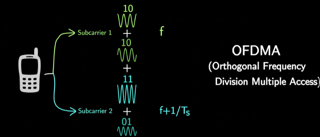

#  OFDM numerology parameters for normal Cyclic Prefix in C++

### Author: Christos Axelos

  

## Table of Contents
- [Overview](#overview)
- [1. Specification](#1-specification)
  - [Reference Documentation & Requirements](#reference-documentation--requirements)
  - [1.1 Numerology μ, subcarrier spacing, num of Subcarriers](#11-numerology-μ-subcarrier-spacing-num-of-subcarriers)
  - [1.2 Number of Slots per Frame/Subframe and Symbols per Slot](#12-number-of-slots-per-framesubframe-and-symbols-per-slot)
  - [1.3 Time Duration of Slots & Symbols](#13-time-duration-of-slots--symbols)
    - [1.3.1 Slot's Duration](#131-slots-duration)
    - [1.3.2 Symbol's Duration](#132-symbols-duration)
    - [1.3.3 Normal Cyclic Prefix's Duration](#133-normal-cyclic-prefixs-duration)
- [3. C++](#3-c)
  - [3.1 Implemented Functions](#31-implemented-functions)
  - [3.2 Compile](#32-compile)
- [4. Testing](#4-testing)
- [References to Literature / Publications](#references-to-literature--publications)

## Overview
* In this project, we calculate the OFDM Numerology parameters for 5G New Radio (NR).
* The user gives in **command line** the  **numerology μ** [0, +4].
* Then, we calculate and print the following OFMD parameters:
  - The Carrier Bandwidth, the Subcarrier spacing (Δf) and the number of Subcarriers.
  - Number of Slots per Frame/Subframe and Symbols per Slot.
  - Duration of Slots & Symbols

## 1. Specification

### Reference Documentation & Requirements
* The implementation is based on the ***3rd Generation Partnership Project*** ([3GPP](https://www.3gpp.org/about-us)) that defines the physical channels and modulation schemes used in 5G New Radio (NR) systems.
* In our case, we use [version 18.5.0](https://standards.iteh.ai/catalog/standards/etsi/d9f7d06f-f6f0-40f3-8ef7-cb0ef6805e37/etsi-ts-138-211-v18-5-0-2025-01?utm_source=chatgpt.com) of 3GPP TS 38.211.

  
### 1.1 Numerology μ, subcarrier spacing, num of Subcarriers
* We take the **numerology μ** as input from the user (value in domain [0, +4]). 
  According to **Section 4.2** of GPP TS 38.211[^1],  "***μ and the cyclic prefix for a bandwidth part are obtained from the higher-layer parameter***". 
* Given the numerology μ:
  - We can calculate the ***number of slots per 1ms subframe***, which is **$$2^\mu$$**.
  - We can also calculate the ***Subcarrier spacing***, according to **Section 4.2** of GPP TS 38.211[^1]. 
  "***The subcarrier spacing Δf is defined as*** 15 × $$2^\mu$$ ***kHz, where μ is the numerology index***".
* At this point, we can approximate ***the number of subcarriers*** that fit in the carrier:
  - Convert bandwidth to kHz: $BW_{\text{kHz}} = BW\ (\text{MHz}) \times 1000$
  - Estimate number of subcarriers as: $N_{\text{sub}} \approx \left\lfloor \frac{BW_{\text{kHz}}}{\Delta f} \right\rfloor$

### 1.2 Number of Slots per Frame/Subframe and Symbols per Slot
  * As we mentioned in 1.1, the ***number of slots per each 1ms subframe*** is **$$2^\mu$$**.
  * In case of 5G NR, each frame contains  ***10 x***  $$2^\mu$$ ***slots***, because the ***number of subframes per each 10ms frame*** is fixed and equal to **10**.
  * In case of 5G NR, the ***number of OFDM Symbols per slot*** is **fixed** and equal to:
    - **14**, in case of ***Normal Cyclic Prefix*** (*Table 4.3.2-1** of GPP TS 38.211[^1])
    <!--- - **12**, in case of ***Extended Cyclic Prefix*** (*Table 4.3.2-2** of GPP TS 38.211[^1]) --->

### 1.3 Time Duration of Slots & Symbols
  * Although it's not directly mentioned in GPP TS 38.211[^1], we can also calculate Slot & Symbol duration.

#### 1.3.1 Slot's Duration
  * In case of 5G NR, **Slot's duration** in ms is ***{Subframe time} divided by {number of slots per subframe}***
  * It is equal to 1 / $$2^\mu$$ **ms**, which means it's not fixed and ***depends on numerology μ***.

#### 1.3.2 Symbol's Duration
  * In case of 5G NR, **Symbol's duration** is equivalent to "the ***period of the slowest subcarrier (= 1/Δf)***" plus "***a fraction of this period***",
      - This fraction can usually be, e.g. 1/4, 1/8, 1/16, 1/32).
      - For simplicity, we'll keep it for this project as a **constant value, equal to 10% of Symbol's duration**.

#### 1.3.3 Normal Cyclic Prefix's Duration
  * Although in 1.3.3 we provide an estimation, in general here we calculate the exact time of Normal Cyclic Prefix Duration.
  * According to [^1], [^2], the cyclic prefix duration is given by $T_{\mathrm{CP}} = 144 \cdot 64 \cdot 2^{-\mu} \cdot T_s$, where $\( T_c = \frac{1}{480 \cdot 10^3 \cdot 4096} = 0.509 \,\text{ns} \)$
  * By Including Cyclic prefix we ***prevent inter-symbol interference*** (ISI).

## 3. C++
### 3.1 Implemented Functions
* Right now, our object-oriented implementation in C++ implements the following private functions:
  - set_subcarrier_spacing_in_kHz();
  - set_num_of_subcarriers();
  - set_num_of_slots_per_frame_and_subframe();
  - set_slot_duration_in_ms();
  - set_symbol_duration_in_us();
  - set_cyclic_prefix_duration_in_us();
  - set_number_of_physical_resource_blocks();
* The public ones are the following:      
  - void get_carrier_bandwidth_MHz_from_user(void);
  - void get_m_index_from_user(void);
  - void compute_params(void);
  - void print_params();
 * You can easily call these functions, after creating an **OFDM** object.

### 3.2 Compile
To compile the project, use the commands in a **command promt**:
  -  `make` for building. It creates the **build** directory with the executable.
  -  `make clean`. It deletes the **build** directory, created during the compilation.

## 4. Testing
* TODO, use some framework to perform Unit Testing in our C++ functions.
    

## References to Literature / Publications

[^1]: TS 138 211 - V15.2.0 - 5G; NR; Physical channels and modulation (3GPP TS 38.211 version 15.2.0 Release 15)
[^2]: Stefano Cioni, Nicolò Mazzali, Alberto Ginesi - Cyclic Prefix Reduction for 5G Non-Terrestrial Networks (2025)
