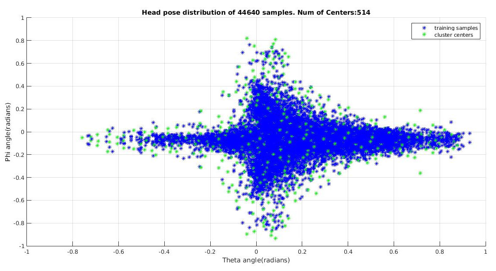
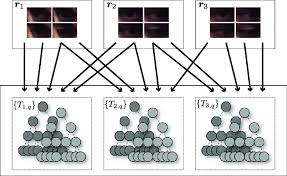
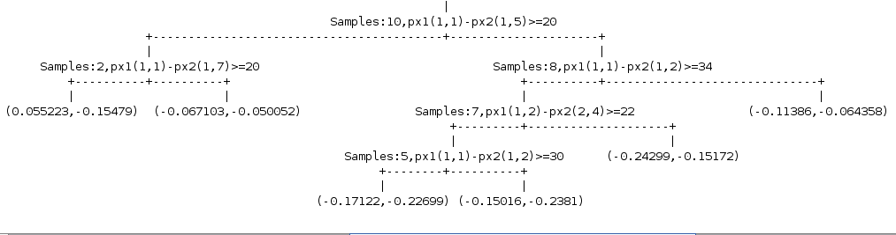

# Regression Forrests algorithm from Scratch in C 

<html>
<body style="background: url(/home/oly/MPIIGaze/markdown/gazeview.jpg) no-repeat center center fixed;
  -webkit-background-size: cover;
  -moz-background-size: cover;
  -o-background-size: cover;
  background-size: cover;">
</body>
</html>

## Experiment on ***Regression Forrest*** hyperparams for the Gaze Recognition problem

## Table of Contents
- [Overview](#overview)
- [1. Data Collection](#1-data-collection)
- [2. Split data into clusters](#2-split-data-into-clusters)
- [3. Training of Regression Forrest](#3-training-of-regression-forrest)
	- [3.1 Training of each Tree](#31-training-of-each-tree)
- [4. How is testing performed](#4-how-is-testing-performed)

## Overview
* This project experiment on the hyperparameters of the algorithm **Regression Forrest** regarding the ***Gaze Recognition problem***.
* Aim of this project are multiple. It began just to gain some experience in one of the best unsupervised algorithms, the Regression Forests. So the best way to learn it is to implement it "from scratch" (it is Regression instead of Decision, since our problem isn't classification but regression.)
* After implementing the prototype in Matlab, we moved forward with a multithreaded C/C++ version in order to achieve parallelism.
* Finally, we verify the correctness of our implementation with the accuracy that the bibliography achieves using the same algorithm/datasets.

## 1. Data Collection

* As data, we chose <a href="https://www.mpi-inf.mpg.de/de/abteilungen/computer-vision-and-multimodal-computing/research/gaze-based-human-computer-interaction/appearance-based-gaze-estimation-in-the-wild-mpiigaze/"
target="_blank">MPIIGaze Dataset</a> [^3]. However, there are also other datasets, such as <a href="https://www.idiap.ch/dataset/eyediap" target="_blank">Eyediap</a> and <a href="http://www.hci.iis.u-tokyo.ac.jp/datasets/" target="_blank">Multiview Dataset</a> [^2].

	- The original images habe been normalized in such a way that all images are examined ***under the same conditions***.
	- In addition, each eye is analyzed ***independently*** from the other.

* The data we have at our disposal are:

	- The images of each eye with dimensions ***(WIDTH,HEIGHT)*** = **(60,36)**
	- ***Ηead Pose***, a 2D vector of angles **in radians** (Theta angle and Phi angle)
	- ***Gaze*** (also a 2D vector in radians), which we try to predict. Each eye is predicted **independently** of the other.

* Explanation of angles **Theta** and **Phi**
	- The **Theta angle** represents the ***horizontal orientation of the head***:
		- For example, if the head is facing to the right, it will have a positive value, while if it is facing to the left, it will have a negative value.
  	- The ***Phi angle** works like Theta, but for the vertical axis:
  		- For example, if the head is tilted upwards, it will have a positive value, while if it is tilted downwards, it will have a negative value.
  	 - Both of these angles range within [-30, +30] degrees.
* For the Random Forest algorithm, we reshape the eye images from (W,H) = (60,36) to (15,9) for both training and testing.

## 2. Split data into clusters

* For the implementation of the algorithm, we based on Breiman's origin implementation [^1], making some changes to the way we choose the **features** during the split.
* In our case, we first group the training samples into **P pose clusters**, based on the **Head Pose**:
	- Each Cluster has a center, which consists of a vector (theta, phi).
	- For a vector (theta, phi) to be considered the center of a Cluster, it must not be at a distance smaller than X from the already existing centers (e.g., in the following figure I use X = 0.08 and 106 Clusters are created).
	- The smaller the value of X, the more Clusters are created.

   
   <figcaption>Diagram illustrating the **Head Poses** of all points in the Training Phase. The cluster centers are shown in green, while the remaining points are shown in blue. The above figure uses **44,640** training samples, with the centers being at a distance **greater than 0.03** radians (1.718873 degrees) from each other.</figcaption>

## 3. Training of Regression Forrest 

* I use the **bootstrap procedure**, randomly selecting inputs.
* We create as many **trees** as there are **Pose Clusters**, that is, P.
* Each tree receives training data from the **R-nearest Clusters**, i.e., the R clusters with the **closest Head Poses**
  με τα __κοντινότερα__ Head Poses
* As the **error**, we take the **mean gaze error** from all the regression trees.

   
   <figcaption><i>Example where <b>neighbouring Clusters</b> contribute to the construction of a tree. The Clusters contain samples with <b>similar Head Poses</b></i> </figcaption>

### 3.1 Training of each Tree

* At **each node** of a tree, we try to **learn functions** of the form:

$$
    f = px1 - px2
$$

* Where, **px1, px2** are the ***Gray values*** of 2 pixels from the  eye Image (W=15,H=9).
* These pixels are learned during training. We also try to learn the __optimal threshold__for each node, where:

	a. if $$ __f < τ__ $$, then the training sample is directed to the __left subtree__.
	b. if $$ __f >= τ__ $$, then the training sample is directed to the __right subtree__.

* The algorithm we use to determine the **optimal pixels** and the **optimal threshold** for the split at **each node** of the tree is the **minimum residual sum of squares**.

$$
\begin{align}
 error =
 \sum_{\substack{i:f_{j}\lt{thres}}}^{nleft}  (g_{i} - \hat{ m_{left} } )^2 + \sum_{\substack{i:f_{j}\ge{thres}}}^{nright} (g_{i} - \hat{ m_{right} } )^2

\end{align}
$$

* The $nleft$ and $nright$ are the **number of samples** that each subtree would have if the split were made based on ***px1, px2 and thres***.

* The $\hat{ m_{right} }$ and $\hat{ m_{left} }$ are the __mean values__ of the gazes that belong to the __right__ and __left__ subtrees, respectively.

* We choose **px1, px2 and thres*** that **minimize** the above sum.

   
    <figcaption><i>Snapshot of a subtree with <b>10 samples</b>. Depending on the values of the samples's <b>Pixels</b>, it will be directed to a <b>terminal node</b>(leaf)</i>   </figcaption>

* The method for learning the split elements is described below:
	1. For every possible pair of pixels (px1, px2)
		2. For every possible threshold
			3. Compute the **rightError** as ***the sum of squares error in the right subtree***  
			4. Respectively for the **leftError**
			5. Error = rightError + leftError
			6. ***If Error < minError ***
				7. minError = Error; minPx1 = px1; minPx2 = px2; minThreshold = threshold

* So that's how we learn via training the **minPx1, minPx2** of each node

## 4. How is testing performed

* When we want to test a sample, we do not send it to all the trees, but only to the **R-nearest trees** based on the head pose.

* We then compute the **average error** from the R-nearest regression trees.

* We are also interested in the **standard deviation**, to see **how close** our predictions are to the **mean error**.

## Evaluation of our algorithm

* During the detailed evaluation of the algorithm, we need to answer the following questions:

  1. What is the **optimal number of Clusters**, or equivalently, what is the **minimum possible distance** between two centers?

  2. What is the **optimal number of training samples**?

  3. What is the **optimal number of neighbors** for each Cluster?

  4. During the creation of subtrees in a tree, how many **split variables** do we use?

  4. How **deep** should each tree be?

  5. If a tree leaf contains **more than one** sample, how is the 2D gaze of that tree determined?

##### Question 1: Finding Minimum Center Distance / Number of Clusters

* Since we have not yet calculated the **optimal number of neighbors**, we initially assume **R = 5 neighbors**.

* Also, to reduce training time, we initially use **10,000 training samples**.
* 
* The number of **split variables** we would use is WIDTH * HEIGHT * THRESHOLD_RANGE = 15 * 16 * 255. Since this number is excessively large, according to Breiman’s paper we will use the **square root** of this number.

* Finally, if a tree leaf contains **more than one** training sample, we simply compute the **average** of the **2D gazes**, resulting in a 2D-gaze vector.

* We do not limit the depth of each tree.

* Based on the above, we calculate the **mean error** and the **standard deviation**.

## References to literature/publications:

[^1]: Breiman, L., Friedman, J.,Olshen, R., and Stone, C. [1984] Classification and Regression Trees,  Wadsworth
[^2]: Y. Sugano, Y. Matsushita, and Y. Sato. Learning-by-synthesis for appearance-based 3d gaze estimation.
[^3]: Z. Zhang, Y.Sugano, M.Fritz, A. Bulling [2015] Appearance-Based Gaze Estimation in the Wild
